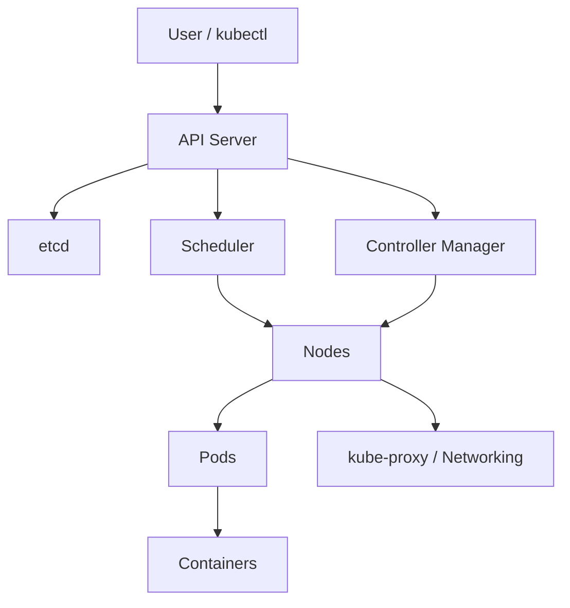

# Kubernetes Architecture

Kubernetes is a **container orchestration platform** that manages deployment, scaling, and networking of containerized applications. Its architecture is based on a **master-worker model**.

---

## 1. Control Plane (Master)

The **control plane** manages the desired state of the cluster.

- **API Server (`kube-apiserver`)**  
  Front-end for all Kubernetes commands; communicates with etcd for cluster data.

- **Scheduler (`kube-scheduler`)**  
  Assigns Pods to Nodes based on resources, policies, and availability.

- **Controller Manager (`kube-controller-manager`)**  
  Runs controllers that ensure the cluster state matches the desired state:

  - Replication Controller
  - Node Controller
  - Deployment Controller

- **etcd**  
  Distributed key-value database storing all cluster configuration and state.

> Analogy: Control plane = the brain of the cluster.

---

## 2. Worker Nodes

Nodes are **machines that run applications (Pods)**.

- **kubelet** – ensures containers in Pods are running.
- **kube-proxy** – handles networking, implements Services.
- **Container Runtime** – software to run containers (Docker, containerd, CRI-O).

> Analogy: Nodes = worker computers in the cluster.

---

## 3. Pods

- Smallest deployable unit in Kubernetes.
- Can contain **one or more containers**.
- Shares **network namespace** and **volumes**.

> Analogy: Pod = a mini virtual machine for your app.

---

## 4. Services

- Provide **stable endpoints** for Pods.
- Types:
  - ClusterIP: internal only
  - NodePort: access via Node IP + port
  - LoadBalancer: external cloud load balancer
  - ExternalName: DNS mapping to external service

> Analogy: Service = stable IP or endpoint for ephemeral Pods.

---

## 5. Ingress

- Manages **external HTTP/S traffic** to Services.
- Features:
  - Host/path-based routing
  - TLS/HTTPS termination

> Analogy: Ingress = traffic controller / reverse proxy.

---

## 6. Add-ons

- **DNS** – auto DNS entries for Services
- **Dashboard** – web UI for managing Kubernetes
- **Monitoring** – Prometheus, Grafana, etc.

---

## 7. High-Level Flow

1. User issues `kubectl apply` to deploy an app.
2. **API Server** receives the request and stores it in **etcd**.
3. **Scheduler** decides which Node the Pod runs on.
4. **Controller Manager** ensures the Pod matches the desired state.
5. **kubelet** on the Node starts the container.
6. **kube-proxy** sets up networking.
7. Pods communicate via Services; external traffic goes through Ingress.

---

## 8. Architecture Diagram (Mermaid)

